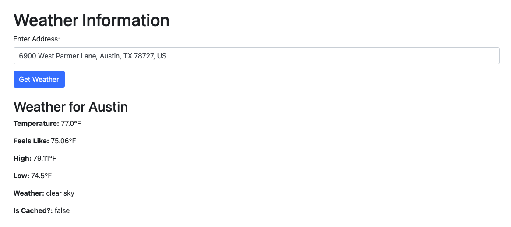

# Weather App

## Overview
This is a simple weather application that retrieves and caches weather forecasts based on a given address. It is built using Java, Spring Boot, and Gradle. 

## Features
- Fetches weather data based on an address.
- Validates address input is correct format
- Config driven cache for weather forecasts to reduce API calls.
- Implements unit and integration testing for reliability.
- Global exception handling. Can be further built on to improve user experience

## Technologies Used
- **Java 17**
- **Spring Boot**
- **Gradle**
- **JUnit & Mockito** (for unit testing)
- **OpenWeatherMap API** (or any other weather API)

## Prerequisites
Ensure you have the following installed:
- Java 17+
- Gradle

## Setup & Installation
1. Clone the repository:
   ```sh
   git clone https://github.com/your-username/weather-app.git
   cd weather-app
   ```
2. Build the project:
   ```sh
   ./gradlew clean build
   ```
4. Run the application:
   ```sh
   ./gradlew bootRun
   ```

## Usage
- Navigate here in browser:
  ```sh
  curl -X GET "http://localhost:8080/weather"
  ```
- Type a well formed address into the input field 
- Press Submit
- Should see relevant weather details like picture below




## Testing
Run unit tests with:
```sh
./gradlew test
```

## Road Map

- Update to use WebClient instead of RestTemplate
     - RestTemplate is good for putting together a quick app like this, but WebClient is a must for scalable microservices

- Update to include a 7 day forecast in the ui
     - This can be done by adding an additional api call to OpenWeatherMap, but isn't a priority for this version

- Include a mechanism to add retry logic to all api calls
     - For a production level app, it's a good practice to wrap api calls in a retry wrapper because api calls are prone to occasional hiccups.

- Make better use of bootstrap to design a prettier UI

---

For any questions, feel free to reach out or open an issue in the repository!
